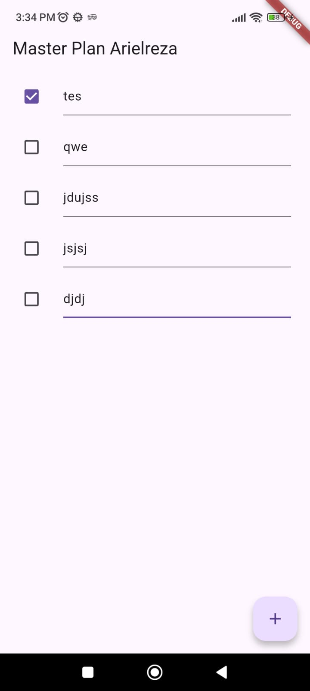

# 🧩 Praktikum 1: Dasar State dengan Model-View

## 📘 Deskripsi
Praktikum ini bertujuan untuk memahami **konsep dasar pengelolaan state (state management)** dalam Flutter menggunakan pendekatan **Model–View**.  
Aplikasi yang dibuat bernama **Master Plan**, yaitu aplikasi sederhana untuk membuat daftar rencana/tugas (to-do list) dengan fitur menambah tugas, menandai tugas selesai, dan menyimpan deskripsi setiap tugas.

---

## ⚙️ Langkah-Langkah
Langkah-langkah praktikum mengikuti panduan pada jobsheet:
1. Membuat project baru `master_plan`
2. Membuat model `task.dart` dan `plan.dart`
3. Membuat file `data_layer.dart`
4. Mengatur file utama `main.dart`
5. Membuat halaman tampilan utama `plan_screen.dart`
6. Menambahkan state management menggunakan `setState()`
7. Menambahkan ScrollController dan lifecycle method (`initState()` & `dispose()`)

---

## 🎥 Hasil Akhir
Berikut adalah **GIF hasil akhir aplikasi Master Plan** setelah menyelesaikan seluruh langkah praktikum:

> (📸 Masukkan di sini GIF hasil running aplikasi kamu)  
> Misalnya: ``

Aplikasi menampilkan daftar tugas dengan fitur:
- Tombol **“+”** untuk menambah task baru.
- Setiap baris memiliki **TextFormField** (deskripsi tugas) dan **Checkbox** (penanda selesai).
- Mendukung **scrolling** serta **fokus otomatis hilang** saat scroll di iOS.

---

## 🧠 Penjelasan Pertanyaan

### 1️⃣ Maksud dari Langkah 4
Langkah 4 membuat file `data_layer.dart` yang berisi:
```dart
export 'plan.dart';
export 'task.dart';
```
Tujuannya agar **proses impor lebih efisien**.  
Daripada mengimpor dua file model satu per satu di berbagai tempat, kita cukup menulis:
```dart
import '../models/data_layer.dart';
```
Ini termasuk **best practice** pada Flutter karena mempermudah manajemen kode ketika aplikasi semakin besar.

---

### 2️⃣ Mengapa perlu variabel `plan` di langkah 6?  
Variabel `plan` digunakan untuk **menyimpan seluruh data rencana dan daftar task** pada halaman `PlanScreen`.

```dart
Plan plan = const Plan();
```

- `plan` menjadi **state utama** di halaman ini.  
- Dengan memanggil `setState()`, data di dalam `plan` akan diperbarui dan UI ikut berubah.
- Kata kunci `const` digunakan agar **nilai awal objek bersifat konstan** (immutable), sehingga Flutter dapat mengoptimalkan performa rebuild widget.

---

### 3️⃣ Hasil dari Langkah 9
Pada Langkah 9, dibuat widget `_buildTaskTile()` untuk menampilkan setiap item `Task` di dalam `ListView`.  
Setiap item terdiri dari:
- **Checkbox** untuk menandai apakah task sudah selesai.
- **TextFormField** untuk menulis atau mengubah deskripsi task.

Contoh tampilan:
> Misalnya: 

Kode utamanya:
```dart
ListTile(
  leading: Checkbox(...),
  title: TextFormField(...),
)
```

**Penjelasan:**
- Checkbox mengubah nilai `complete` dari task.
- TextFormField memperbarui deskripsi task.
- Setiap perubahan memicu `setState()` → UI otomatis diperbarui.

---

### 4️⃣ Kegunaan method pada Langkah 11 dan 13

#### `initState()` (Langkah 11)
Digunakan untuk **inisialisasi pertama kali** ketika widget dibuat.  
Di sini digunakan untuk menambahkan listener pada `ScrollController` agar setiap kali pengguna melakukan scroll, fokus dari `TextField` hilang otomatis:
```dart
FocusScope.of(context).requestFocus(FocusNode());
```
Hal ini mencegah keyboard menutupi input di bagian bawah layar (terutama di iOS).

#### `dispose()` (Langkah 13)
Digunakan ketika **widget dihapus dari tree Flutter**.  
Method ini memastikan **resource dibersihkan** agar tidak terjadi memory leak:
```dart
scrollController.dispose();
```
Dengan begitu, `ScrollController` tidak terus aktif di background.

---

## 📎 Cara Menjalankan
1. Buka project di VS Code atau Android Studio.  
2. Jalankan perintah:
   ```bash
   flutter run
   ```
3. Tekan **Hot Restart (Ctrl + Shift + F5)** untuk memuat ulang seluruh state aplikasi.

---

## 🔗 Link Repository
[🔗 Klik di sini untuk melihat repository GitHub](https://github.com/arielreza/master_plan)  
*(Ganti dengan link repo kamu sebelum dikumpulkan ke dosen)*

---

## 👤 Disusun oleh
**Nama:** M. Mahdi Arielreza  
**NIM:** 2341760049  
**Kelas:** SIB-3D  
**Mata Kuliah:** Pemrograman Mobile  
**Dosen Pengampu:** Ade Ismail, S.Kom., M.Kom.

---
